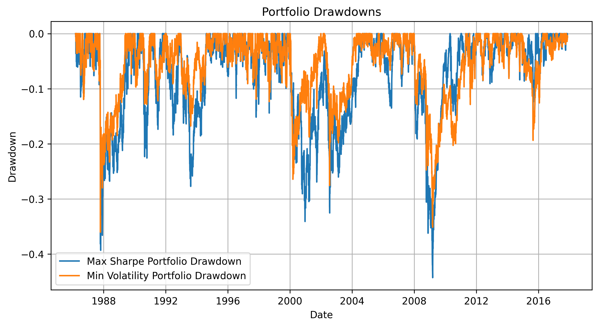
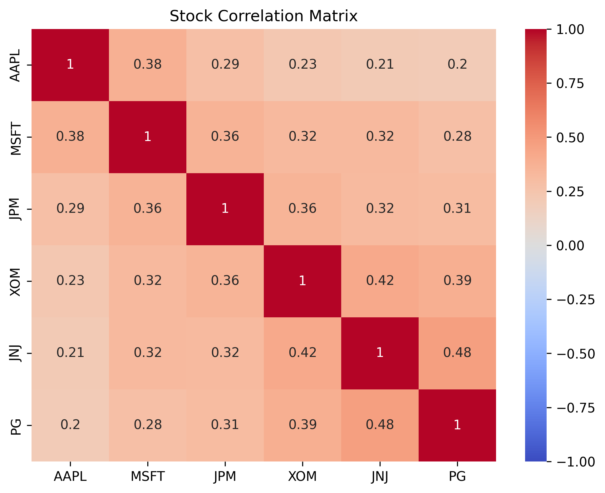
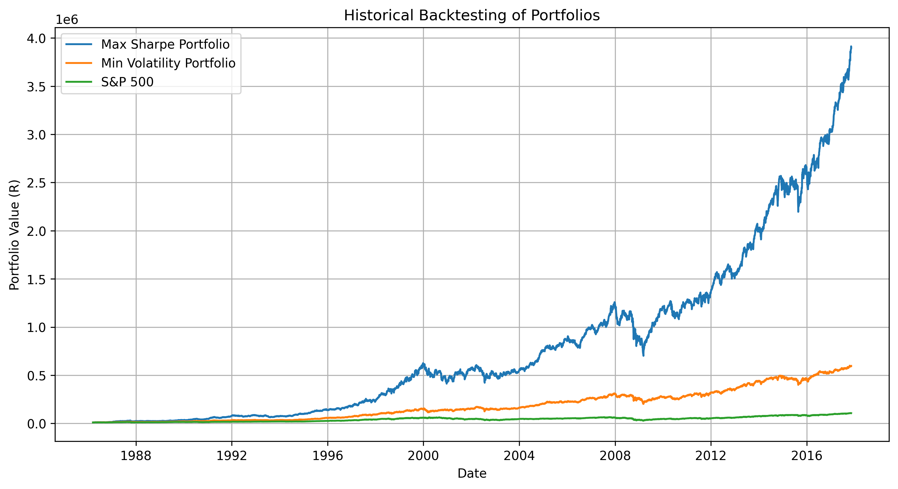

# Portfolio_Optimization_and_Risk_Analysis

## Project Overview
This project applies Modern Portfolio Theory (MPT) and the Capital Asset Pricing Model (CAPM) to build and evaluate an optimal investment portfolio.
Using six major U.S. stocks, the analysis identifies the Maximum Sharpe Ratio and Minimum Volatility portfolios, simulates market conditions, and backtests performance against the S&P 500 benchmark.

Stocks analyzed: AAPL, MSFT, JPM, XOM, JNJ, PG 
Benchmark: S&P 500 Index 
Investment Base: R10,000 (or $10,000 equivalent)

## Objectives
- Construct a diversified portfolio to maximize risk-adjusted returns.  
- Analyze performance under different market scenarios (bull, bear, moderate).  
- Evaluate portfolio risk using VaR, CVaR, and maximum drawdown.  
- Backtest results to assess real-world performance.  

## Tools and Libraries
- Python
- yfinance – for downloading historical stock and index data
- pandas and numpy – for data manipulation and analysis
- matplotlib and seaborn – for visualization
- scipy – for optimization calculations

## Data Preparation
- Historical daily price data (2020–2025) was downloaded using yfinance.
- Daily and annualized returns were computed for all six stocks and the S&P 500.
- The data was aligned to ensure matching trading dates across assets.

## Methodology  

### Compute Returns and Risk Metrics  
- Calculated daily and annualized mean returns and volatility.  
- Created a correlation matrix to understand asset relationships.  

### Efficient Frontier Construction  
- Generated thousands of random portfolios.  
- Calculated expected return, volatility, and Sharpe ratio for each.  
- Identified:  
  - Maximum Sharpe Ratio Portfolio  
  - Minimum Volatility Portfolio  

### Risk Evaluation  
- Calculated Value-at-Risk (VaR) and Conditional Value-at-Risk (CVaR).  
- Measured Maximum Drawdown to understand potential losses.  

### Market Scenario Simulation  
- Modeled portfolio performance under:  
  - Bull Market: +20% annual return  
  - Bear Market: -20% annual return  
  - Moderate Market: +5% annual return  

### Backtesting  
- Simulated the growth of a R10,000 investment from 2020–2025.  
- Compared portfolio growth to the S&P 500 benchmark.

## Results Summary  

| Portfolio        | Expected Return | Volatility | Sharpe Ratio | Max Drawdown | VaR (95%) | CVaR (95%) |
|------------------|-----------------|-------------|---------------|---------------|------------|-------------|
| Max Sharpe       | 21.2%           | 21.4%       | 0.946         | -44.27%       | 30.97%     | 46.77%      |
| Min Volatility   | 14.6%           | 18.0%       | 0.810         | -36.02%       | 25.48%     | 39.21%      |

### Interpretation:
- The Max Sharpe portfolio provides higher returns but is more volatile.
- The Min Volatility portfolio offers steadier returns with less downside risk.
- Portfolio selection depends on investor risk preference.

### Efficient Frontier (with optimal portfolios highlighted)
 

### Risk vs Return

### Portfolio Drawdowns

### Correlation

### Historical Backtesting of Portfolios
We simulate how the portfolio would have performed in the past using actual historical stock and benchmark data. By applying the portfolio weights (Maximum Sharpe and Minimum Volatility) to daily returns from 2020–2025, we can calculate cumulative returns, volatility, and risk metrics. This allows us to:
- Assess how the portfolio would have grown over time.
- Compare performance against the S&P 500 benchmark.
- Understand the potential risks and drawdowns under real market conditions.
- Validate whether our portfolio construction methods (Markowitz optimization, CAPM) would have produced favorable outcomes historically.

## Key Insights
- Diversification across sectors (tech, finance, energy, healthcare, consumer) reduced portfolio risk.
- Both portfolios outperformed the S&P 500 in moderate and bull markets.
- The Max Sharpe portfolio showed higher long-term growth potential despite greater short-term volatility.

## Skills Demonstrated
- Financial data analysis using Python
- Portfolio optimization and performance evaluation
- Application of Modern Portfolio Theory and CAPM
- Backtesting and risk simulation
- Data visualization and interpretation
